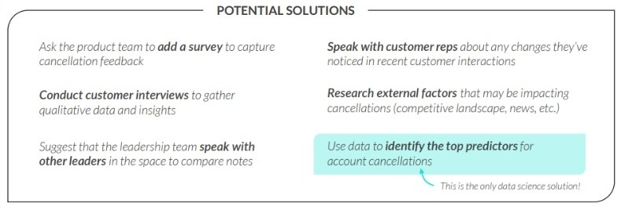
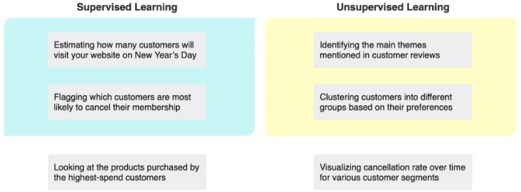
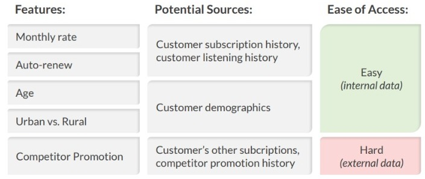

## **Streaming Service Project:**

> Goal: **data gathering**, **cleaning** and **expoloratory analysis**.

**Situation**: you've just been hired as jr. data scientist for a streaming service that's been losing more customers than usual the past few months and would like to use data science to figure out how to reduce customer churn.

**Assignment**: You'll have access to data on this streaming service customers, including subscription details and music listening history. Your task is to gather, clean, and explore the data to provde insights about recent customer churn issues, then prepare it for modeling in the future.

**Objectives**:
1. **Scope** the data science project:
    - Who are your end user or stackeholders?
    - What business problems are you trying to help them solve?
    - Is this a supervised or unsupervised learning problem? _(do you even need data science?)_
    - What data do you need for you analysis?
    
2. **Gather** the data in Python (Data can come from a variety of sources):
    - files (flat files, spreadsheets, etc) 
    - databases (relational and non-relational)
    - websites
    - APIs, etc.

3. **Clean** the data:
    - Correcting data types
    - Imputing missing data
    - Dealing with data inconsistencies
    - Reformatting the data

4. **Explore** & visualize the data (EDA) -> a good number of the **final insights** that you share will come from the EDA phase:
    - Slicing & dicing the data
    - Summarizing the data
    - Visualizing the data

5. **Prepare** the data for modeling:
    - Restructuring the data
    - Feature engineering (adding new fields)
    - Applying ML algorithms
    
6. **Sharing** insights (the focus here is on **non-technical solutions** -> the potential impact of your analysis):
    - Reiterate the problem
    - Interpret the results of your analysis
    - Share recommendations and next steps
    - _NOTE:_ another way to share results is to deploy your model, or put it into production.

#### **Scoping the poblem:** 

_What is the problem?_
What is causing the cancellation rate increase?
- is the product differentiated from competitors?
- are technical bugs or limitations to blame?
- is the product too expensive?
- do we need to expand our music library?
- do we even know **WHY** customers are cancelling?

_What are the potential solutions?_

> Supervised or Unsupervised learning problem?

#### **Data Structure**

- How you **structure your data** often depends on which technique you're using:
    - A **supervisded** learning model takes in **labeled** data (the outcome you want to predict). -> **predict**
        - Example: _Predicting which customers are likely to cancel._
    - An **unsupervised** learning model takes in **unlabeled** data. -> **patterns** or **relationships**
        - Example: _Clustering customers based on listening behavior._

#### **Model Features**

To identify relevant model features, brainstorm any potential variables that might be useful as model inputs based on your goal, for example:
- Supervised learning: features that will do a good job predicting cancellations
- Unsupervised learning: features that will do a good job differentiating customers

#### **Data Sources**

> Next, narrow the scope of your data to remove sources that are difficult to obtain and prioritize the rest: **Remember that more data doesn’t necessarily mean a better model!**

#### **Summarize the scope and objectives**

- What techniques and data do you plan to leverage?
- What specific impact are you trying to make?

### **Final scope for Steaming Service:**
'We plan to use **supervised learning** to predict which customers are likely to cancel their subscription, using **the past three months of subscription and listening history**. This will allow us to:
- Identify the **top predictors for cancellation** and figure out
how to address them;
- Use the model to **flag customers who are likely to cancel**
and take proactive steps to keep them subscribed;

Our goal is to **reduce cancellations by 2%** over the next year'